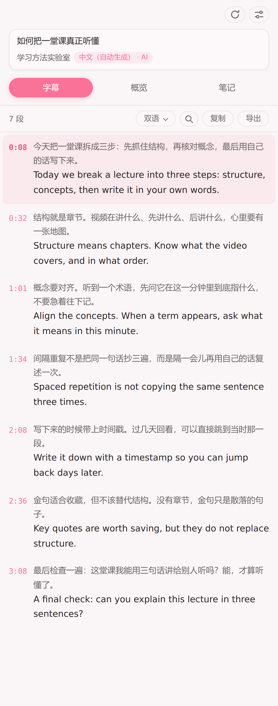
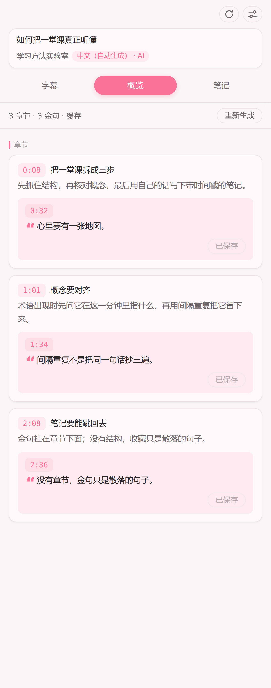
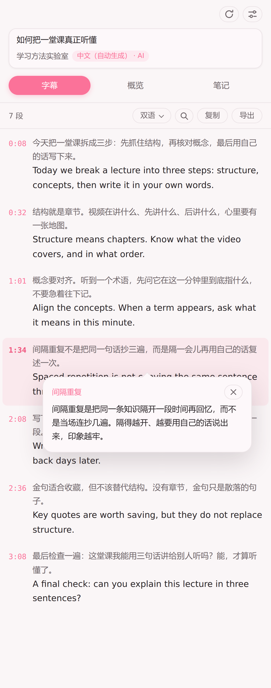
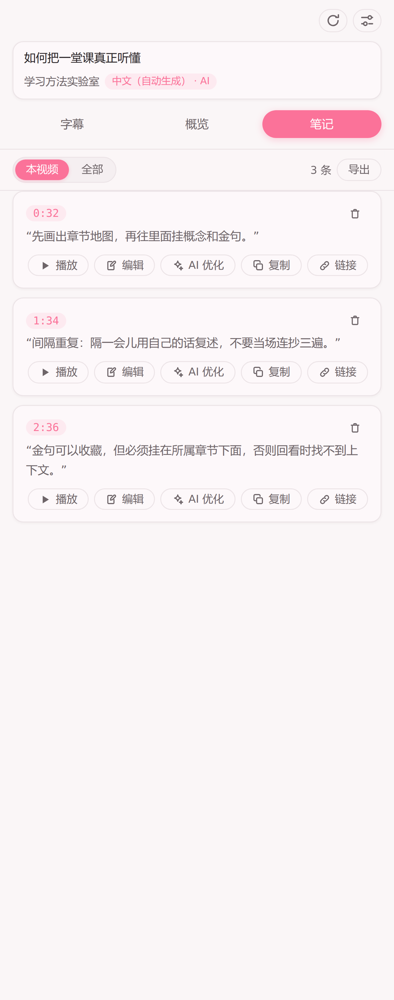
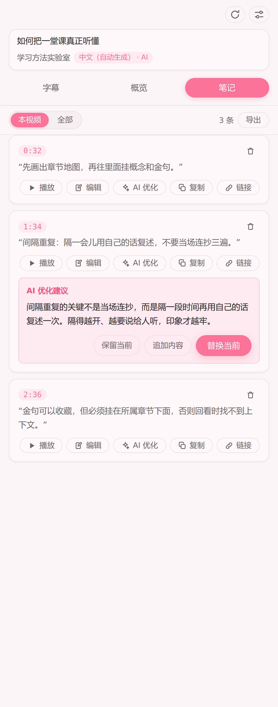

# Digest for Bilibili

把 B 站视频变成学习资源：在播放页旁边打开侧边栏，阅读字幕、对照双语、生成章节概览、划词解释，并记下带时间戳的笔记。

**B 站网页端的 [youtube-digest](https://github.com/zarazhangrui/youtube-digest) 复刻项目**，架构蓝本与提示词起点来自上游仓库（MIT）。

---

## 安装（Chrome 与 Edge 商店）

同一份代码、同一个安装包，两边功能没有差别。需要 116 及以上的版本。

| 商店 | 上线日期 | 安装链接 |
| --- | --- | --- |
| Chrome Web Store | 2026-08-15 | [安装 Digest for Bilibili](https://chromewebstore.google.com/detail/digest-for-bilibili/cfndfabkpfgihcgknbgfnkjlmndhhmfc) |
| Microsoft Edge Add-ons | 2026-08-17 | [安装 Digest for Bilibili](https://microsoftedge.microsoft.com/addons/detail/digest-for-bilibili/jlfmjhkcbnkgghefieaagkcccjojmnkm) |

商店索引可能稍晚更新，直达链接可正常使用。

---

## 字幕

字幕取自 B 站官方接口，不经第三方服务。

- 原文 / 译文 / 双语三种视图；中文译英、外文译中，方向按字幕轨语种自动选择
- 顺句：为 AI 字幕补标点、改同音错别字，不改措辞、不动时间轴
- 顺句与翻译显示批次进度，可随时停止；已完成内容保留
- 当前句跟随播放高亮，点一句跳到对应时间；跟丢了有「回到当前句」
- 全文搜索（快捷键 `/`）、复制、导出 TXT

## 概览

AI 通读字幕，产出带时间戳的章节，金句按时间挂在所属章节之下。点章节或金句即可跳转。

长视频按分段切块并发生成，块与块之间携带重叠上下文；部分失败不影响已完成的部分。生成期间可停止，完成后可重新生成。分块长度与重叠字数在设置页调整。

## 划词解释

选中字幕里的术语或概念，点「解释」。AI 结合前后文用大白话说明，浮层贴在选中文字旁边。

## 笔记

播放时点播放器上的「笔记」或按 `n`，记下当前时间点。AI 把当时那句字幕整理成通顺一句话。

卡片可编辑、回放、复制和跳转。手动改过正文后，可让 AI 给出优化建议，预览后再选择保留、替换或追加。优化可以停止，取消不改写正文。

笔记按视频与分 P 保存；可只看当前分 P，或翻全部历史。当前列表可导出为带时间戳链接的 Markdown，范围跟「本视频 / 全部」一致。

## 本地加载

商店安装见顶部 [安装](#store-install)。

跑 `npm run package` 得到 `dist/` 下的 zip，解压后打开扩展管理页（`chrome://extensions` 或 `edge://extensions`），开启开发者模式，加载解压目录。

装好后会打开设置页。字幕阅读开箱即用；顺句、翻译、概览、划词解释和笔记整理需要先填模型服务地址和密钥。

商店审核底稿见 [STORE-LISTING.md](STORE-LISTING.md)。

## 许可与致谢

[MIT](LICENSE)。源自 [youtube-digest](https://github.com/zarazhangrui/youtube-digest)（MIT，Copyright (c) Zara Zhang），架构蓝本与部分提示词模板来自该仓库。出处见 LICENSE 与 `prompts/` 各文件头部。
